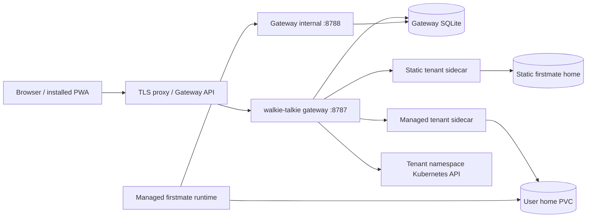

# Architecture

Start with the [documentation index](README.md) for the current atus deployment
and the [security guide](security.md) for trust boundaries.

## Components and modes

The Node.js service has two modes selected by `FM_WT_MODE`. Both serve the same
browser app from `public/`. TLS is handled by a reverse proxy or Kubernetes
Gateway, not by the Node service. There are no npm runtime dependencies.
Gateway persistence and full OpenCode history use built-in `node:sqlite`;
use Node 22.13 or newer for those features.

| Component | Responsibility | Implementation |
| --- | --- | --- |
| Browser PWA | Tabs, composer, speech input, device/account/setup/admin controls, foreground polling | [app.js](../public/app.js), [index.html](../public/index.html), [voice.js](../public/voice.js) |
| Service worker | Network-first shell fallback, updates, push display, notification navigation | [sw.js](../public/sw.js) |
| Standalone API | Reports on one home and queues notes through firstmate scripts | [server.ts](../src/server.ts), [firstmate.ts](../src/firstmate.ts) |
| Conversation readers | Read-only herdr enumeration and OpenCode history; fleet-derived badges | [conversations.ts](../src/conversations.ts), [conversation-store.ts](../src/conversation-store.ts), [fleet-state.ts](../src/fleet-state.ts) |
| Firstmate live reader | Primary activity, receiving readiness, and unacknowledged queue | [firstmate-live.ts](../src/firstmate-live.ts) |
| Push service | Per-firstmate VAPID pair, subscriptions, event detection and delivery | [push-service.ts](../src/push-service.ts), [push-store.ts](../src/push-store.ts), [webpush.ts](../src/webpush.ts) |
| Gateway | OAuth, sessions, admission, account routes, tenant selection and forwarding | [gateway.ts](../src/gateway.ts), [github-oauth.ts](../src/github-oauth.ts), [gateway-proxy.ts](../src/gateway-proxy.ts) |
| Gateway store | Users, sessions, invitations, audit, encrypted keys, choices, desired/observed tenant state | [gateway-store.ts](../src/gateway-store.ts) |
| Setup and vault | Catalog validation, key checks, encrypted storage and model selection | [gateway-setup.ts](../src/gateway-setup.ts), [key-check.ts](../src/key-check.ts), [vault.ts](../src/vault.ts) |
| Reconciler | Makes tenant Kubernetes objects match store state; observes pods and purges removed homes | [reconciler.ts](../src/reconciler.ts), [tenant-objects.ts](../src/tenant-objects.ts), [kube.ts](../src/kube.ts) |
| Credential delivery | Internal authenticated pull of only a tenant's selected provider key and optional GitHub token | [tenant-delivery.ts](../src/tenant-delivery.ts), [tenant-tokens.ts](../src/tenant-tokens.ts) |

**Standalone** serves one home. Its private API uses a bearer token held by
the browser. `/api/health`, `/api/push/config`, and static assets are public.
Status and receipts come from firstmate's documented scripts. The service's
firstmate write is `fm-inbox.sh note`; push subscription storage is separate.
The herdr client permits only pane list/read, workspace list, and tab list.

**Gateway** serves the public shell, authenticates users, and resolves their
upstreams. It never reads a firstmate home or invokes its scripts. Account,
setup, and admin data live in its own store. Forwarded firstmate content is
not persisted or logged by the gateway. With provisioning enabled it also
uses the in-cluster Kubernetes API and opens an internal credential listener.
Without an in-cluster API, it logs that reconciliation is off; setting tenant
parameters alone does not create workloads on a development machine.

The managed paths in this diagram require provisioning. Atus currently uses
only the gateway and static-tenant path. A standalone deployment goes directly
from the TLS proxy to the standalone API and has no gateway store.

## Static and managed tenants

| Property | Static tenant | Managed tenant |
| --- | --- | --- |
| Ownership | Declared GitHub numeric id and upstream | Gateway user id, with opaque tenant id assigned on first Start |
| Workload | Operator-owned; the release's existing firstmate is one | Reconciler-owned StatefulSet `fm-<tid>` in `gateway.tenantNamespace` |
| Provider/model | Operator's `agents.*` and credentials | User's catalog choice and encrypted keys |
| Setup and lifecycle UI | Setup hidden; configuration manages it | Setup; Start/Stop when provisioning is enabled |
| API token | Existing upstream bearer from Secret reference | Derived from the gateway's tenant-token master |
| Storage | Existing home volume | `home-fm-<tid>-0`, one ReadWriteOnce home claim |
| Removal | Change operator configuration | Admin removal prunes workload and retains home until purge |

Admission does not provision a tenant. Approval creates an account; an invite
is redeemed at sign-in. Saving a key or model does not start anything. First
Start records a tenant id and desired state, then kicks the reconciler.

Each managed tenant has a firstmate runtime, a standalone walkie-talkie
sidecar, and an init container that copies the runtime's herdr CLI for the
sidecar. The two main containers share only that tenant's home. Generated
`opencode.json` sets the selected main model, `small_model` (routine model or
main model), and one enabled provider. `crew-dispatch.json` uses the main
model by default and adds the routine rule only when a routine model exists.

## Request flow

1. The app probes `GET /auth/session`. In gateway mode this reports session
   and feature information without exposing a secret. Standalone has no such
   route; the app uses its saved token.
2. GitHub sign-in starts at `/auth/github/start`, with state and PKCE S256.
   The callback consumes the short-lived login attempt, reads the public
   profile, and applies admission rules. The GitHub OAuth token is discarded.
3. An admitted account receives its own random session cookie. Later requests
   resolve the cookie to an active user through its stored hash. Cookie-based
   writes must pass the same-origin check.
4. Gateway-owned routes handle devices, setup, or administration. Firstmate
   routes use a fixed method/path allowlist and select an upstream only from
   the authenticated account.
5. The gateway strips browser cookies, authorization and forwarding headers,
   then adds the upstream bearer. It passes only `accept` and `content-type`
   from the incoming request. Responses retain only upstream content type
   and length; the gateway adds `no-store` and `nosniff`.
6. The sidecar executes bounded reads or queues a note with text on stdin.
   The reply returns through the gateway. An upstream `401` becomes a gateway
   `502`, because an incorrect internal bearer is a deployment fault. The
   default upstream timeout is 70 seconds and produces `504`.

While the migration bridge is enabled, an old browser bearer can instead act
as the first configured admin for the allowlisted firstmate APIs. It cannot
use account, setup, or admin routes. A successful GitHub sign-in makes the
app forget the saved shared token.

## API map

These are implemented routes, not proposed interfaces. Reads generally also
support `HEAD`; the internal delivery route accepts only `GET`.

| Boundary | Routes | Authentication |
| --- | --- | --- |
| Public gateway | `GET /healthz`, `GET /auth/session`, `GET /auth/github/start`, `GET /auth/github/callback`, static shell | No existing user session required |
| Session actions | `POST /auth/logout`, `POST /auth/link/code` | Same-origin; code creation requires a session, logout clears a supplied session |
| Link redemption | `POST /auth/link/redeem` | Same-origin, one-time code, rate limit |
| Own devices | `GET /api/me/devices`, `DELETE /api/me/devices`, `DELETE /api/me/devices/<handle>` | Real GitHub session |
| Setup | `GET /api/catalog`, `GET/PUT /api/me/firstmate`, `POST /api/me/firstmate/start`, `POST /api/me/firstmate/stop` | Real session; catalog configured; lifecycle also needs provisioning |
| Credentials | `GET /api/me/credentials`, `PUT/DELETE /api/me/credentials/<ENV_NAME>` | Real session; keys are write-only |
| Admin | Users, invites, requests, retained homes and audit under `/api/admin/` | Real session and configured admin id; see [admin guide](admin-guide.md#admin-api) |
| Firstmate proxy reads | `/api/health`, `/api/status`, `/api/firstmate`, `/api/receipts`, `/api/sessions`, `/api/sessions/<pane-id>`, `/api/push/config` | Session or enabled legacy bridge |
| Firstmate proxy writes | `POST /api/note`, `/api/push/subscribe`, `/api/push/unsubscribe`, `/api/push/test` | Session with same-origin check, or enabled legacy bridge |
| Internal credential listener | `GET /internal/v1/credentials` | Tenant credential token; only bound when provisioning is configured |

There is no `GET /api/me` profile route; use `/auth/session` and
`/api/me/firstmate`. `/api/push/notify` exists on a standalone sidecar for
gateway-originated admin notices, but is never forwarded from a browser.
Unknown gateway API paths return `404`, not a generic upstream proxy.
See the [standalone endpoint reference](../README.md#endpoints) for payloads,
cursor pagination, and note context.

## Data stores and refresh

| Store | Location | Contents and ownership |
| --- | --- | --- |
| Gateway SQLite | Default `./walkie-talkie.gateway.db`; chart `/data/walkie-talkie.gateway.db` on gateway PVC | Accounts, session hashes, login attempts/state hashes and PKCE verifiers, invites, requests, link-code hashes, audit, encrypted credentials, choices, tenant and retained-home rows |
| Firstmate home | Configured `FM_HOME`; chart default `/home/firstmate` | Firstmate state, inbox receipts, repositories, session files; the gateway never mounts it |
| OpenCode SQLite | Default `$FM_HOME/.local/share/opencode/opencode.db` | Agent-owned conversation history; sidecar opens it read-only with `query_only` |
| Push JSON | Default `./walkie-talkie.push.json`; managed sidecar `$FM_HOME/.walkie-talkie/push.json` | Each push-enabled firstmate's VAPID keys, device subscriptions and event state; static chart does not override the default path |
| Browser | Session cookie, standalone/legacy token in localStorage, service-worker shell cache | Device authentication and static assets; worker excludes `/api/` and `/auth/` from caching |

The gateway creates its database with mode `0600`, enables foreign keys,
`secure_delete`, WAL and a five-second SQLite busy timeout. It migrates the
schema at startup and refuses a database newer than the build understands.
Only saved provider keys and user GitHub tokens are vault-encrypted; accounts,
choices, and audit metadata are not. The chart uses one gateway replica and `Recreate` to avoid
overlapping writers on its ReadWriteOnce claim. Its claim is kept when the
gateway is disabled or the release uninstalled.

The static chart and committed atus values do not set `FM_WT_PUSH_STORE` or
mount the image's default `/app` path as persistent storage. Configure a
writable path on the shared home to keep static push state; see
[operations](operations.md#persistence-backups-and-rollback). A push-store
write failure disables push while the rest of the standalone service continues.

The Status tab polls every 10 seconds while visible. Conversations refreshes
lists/live state every 5 seconds and open output every 3 seconds. Both stop
when hidden and immediately refresh on foreground return. Setup polls settling
lifecycle states every 5 seconds, bounded to 36 scheduled refreshes.
The server push poll defaults to 20 seconds and does not depend on an open tab.

The reconciler runs after desired-state changes and every 60 seconds, or
every 5 seconds while tenants/purges are settling. It applies Secret,
ConfigMap, Service, StatefulSet in order; prunes in reverse. Failed listings
do not trigger pruning for that kind. Managed fields drift back to store
state. Existing claim templates remain unchanged after storage settings
change. A choice removed from the catalog leaves a running workload unchanged;
stop and suspension still scale it to zero. See
[operations](operations.md) for the separate retained-home purge and backups.
